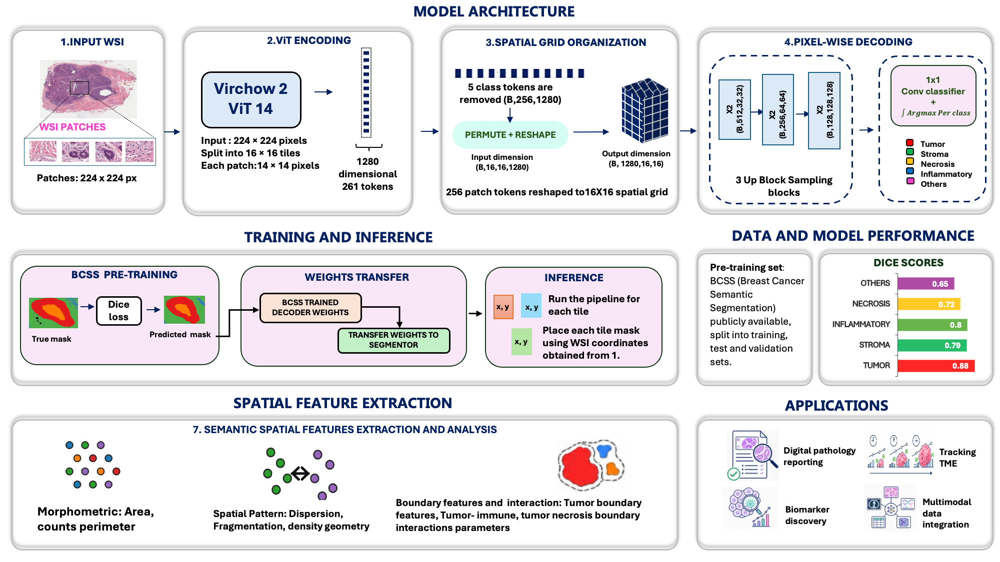

# ViSPACE — Virchow2 powered Spatial Characterization and feature Extraction Pipeline

ViSPACE is an end-to-end computational pathology pipeline for analysing
whole-slide images (WSIs). The pipeline combines the Virchow2 foundation
model with a pixel-wise segmentation decoder to generate five-class tissue
segmentations and extract quantitative spatial biomarkers from the tumour
microenvironment (TME).

## Features

- End-to-end WSI analysis
- Virchow2-powered semantic segmentation
- Five tissue classes
  - Tumour
  - Stroma
  - Inflammatory (TILs)
  - Necrosis
  - Others
- Tumour ROI generation
- TSR and sTIL scoring
- Immune proximity analysis
- Necrosis proximity analysis
- Tumour morphology analysis


<p align="center">
  <br>
  <em>Detailed pipeline architecture — tessellation through spatial feature extraction</em>
</p>


---

---

# Documentation

Complete documentation is available in the **ViSPACE User Manual**.

---
# Recommended System Requirements

| Component | Recommended |
|-----------|-------------|
| Python | 3.11 |
| GPU | NVIDIA RTX 3080 / RTX 4090 / A5000 |
| CUDA | 12.1 |
| RAM | 32–64 GB |
| VRAM | ≥16 GB |
| Storage | SSD/NVMe |

ViSPACE was developed and tested using

- Python 3.11
- PyTorch 2.5.1
- CUDA 12.1
- NVIDIA RTX 4090 
---

## Table of Contents

0. [Prerequisites](#prerequisites)
1. [Overview](#overview)
2. [Quick Start](#quick-start)
3. [CLI Reference](#cli-reference)
4. [Running in a Jupyter Notebook](#running-in-a-jupyter-notebook)
5. [Pipeline Stages](#pipeline-stages)
6. [Configuration Reference](#configuration-reference)
7. [Output Directory Layout](#output-directory-layout)
8. [Feature Descriptions](#feature-descriptions)
9. [Running Subsets of Stages](#running-subsets-of-stages)
10. [Dependencies](#dependencies)
11. [Citation](#citation)
12. [License](#license)

---

## Prerequisites

Python **3.11** and, for GPU inference, an NVIDIA GPU with CUDA 12.1 (see
[Recommended System Requirements](#recommended-system-requirements)).

# Installation

ViSPACE is a pip-installable package. Any of the options below installs the
`vispace` package plus two console commands — `vispace` (run the pipeline) and
`vispace-check` (validate the environment).

### Option A — install from source *(recommended)*

```bash
# Create a new environment
conda create -n vispace python=3.11 -y

# Activate it
conda activate vispace

# Clone the repository
git clone https://github.com/himangi2003/ViSpace.git
cd ViSpace

# Install the matching PyTorch build
pip install torch==2.5.1+cu121 torchvision==0.20.1+cu121 \
    --extra-index-url https://download.pytorch.org/whl/cu121

# Install the package and its dependencies
pip install .
```

Use an **editable** install (`pip install -e .`) if you plan to modify the code —
changes take effect without reinstalling.

> **CPU-only / no CUDA?** Skip the explicit `torch` line and just run
> `pip install .`; pip resolves the default CPU build of `torch==2.5.1`.

### Option B — Conda environment

```bash
conda env create -f environment.yml
conda activate vispace
pip install .
```

### Option C — Google Colab

```bash
pip install -q -r requirements/colab.txt
pip install -q .
```

See **Chapter 1** of the User Manual for complete installation instructions.

---

# Hugging Face Authentication and Virchow 2 access

Virchow2 is a **gated model** — you need a HuggingFace account and access token before the weights can be downloaded (skip this entirely if you set `VIRCHOW2_PATH` to local weights instead).

Request access at <https://huggingface.co/paige-ai/Virchow2>

Authenticate once using

*Method A — CLI (recommended for servers & scripts):*

```bash
pip install huggingface_hub
huggingface-cli login
# Paste your token when prompted — input is hidden, this is expected
huggingface-cli whoami   # verify
```

To persist across sessions:

```bash
echo 'export HF_TOKEN=hf_your_token_here' >> ~/.bashrc   # or ~/.zshrc
source ~/.bashrc
```

*Method B — Jupyter notebook cell* (see `notebooks/ViSpace_tutorial.ipynb` for the full walkthrough):

```python
import os
from huggingface_hub import whoami

# ✏ Paste your HF access token here (Read role is sufficient)
HF_ACCESS_TOKEN = "hf_your_token_here"

user = whoami(token=HF_ACCESS_TOKEN)
print(f"Authenticated as: {user['name']}")

os.environ["HF_TOKEN"] = HF_ACCESS_TOKEN
print("HF_TOKEN environment variable set.")
```

Alternatively, local Virchow2 weights can be specified using
`VIRCHOW2_PATH`.

Complete instructions are provided in **Chapter 1** of the Vispace User Manual in docs.

---

# Model Weights

ViSPACE relies on two separate sets of weights:

1. **Virchow2 encoder** — the foundation model that embeds each tile. It is
   **not bundled**: download it from the gated Hugging Face repository
   [`paige-ai/Virchow2`](https://huggingface.co/paige-ai/Virchow2) (see
   *Hugging Face Authentication* above), or point `VIRCHOW2_PATH` at a local copy.
   Access is gated — first request it (free) on the model page at
   <https://huggingface.co/paige-ai/Virchow2> and authenticate with your Hugging
   Face token before the first run; the weights download automatically once granted.
2. **ViSPACE segmentation decoder** — the lightweight head that turns Virchow2
   features into the five-class tissue mask. Two trained checkpoints **ship
   inside the installed package** under `vispace/assets/weights/`, so no
   download is required:

   | Checkpoint | Trained on | Use for |
   |---|---|---|
   | `TNBC_best.pt` *(default)* | TCGA breast / TNBC (BCSS) | breast / general H&E |
   | `IGNITE_lung_best.pt` | IGNITE lung cohort | lung H&E |

**Selecting the decoder.** `CHECKPOINT` defaults to the bundled `TNBC_best.pt`.
To use the lung decoder (or your own `.pt`), set `CHECKPOINT` to its path.

*Python:*

```python
from pathlib import Path
import vispace
from vispace import PipelineConfig

weights = Path(vispace.__file__).parent / "assets" / "weights"

cfg = PipelineConfig(
    WSI_PATH   = "slides/your_lung_slide.svs",
    CHECKPOINT = str(weights / "IGNITE_lung_best.pt"),   # lung cohort
    # omit CHECKPOINT entirely to use the default TNBC_best.pt
)
```

*CLI:*

```bash
# print the bundled weights directory, then pass the checkpoint you want
python -c "import vispace, pathlib; print(pathlib.Path(vispace.__file__).parent / 'assets' / 'weights')"

vispace --wsi-path slides/your_lung_slide.svs \
        --checkpoint /path/to/vispace/assets/weights/IGNITE_lung_best.pt
```

---

# Environment Check (Optional)

Before processing any slide, verify the installation with the `vispace-check`
console command (installed with the package):

```bash
vispace-check                              # validate the current environment
vispace-check --from-json run_config.json  # also validate the paths in a saved config
```

This validates

- Python environment
- CUDA availability
- PyTorch installation
- Virchow2 dependencies
- Mussel installation
- Model checkpoints
- Output directories

See **Chapter 2** for further details.

# Running a Test

There is no unit-test suite yet — the pipeline's real test is an end-to-end run
on a slide. Use the checks below to confirm the install is wired up before
committing to a long run.

**1. Smoke test — package import, console commands, and bundled assets:**

```bash
# Run from any directory to prove nothing depends on the current folder.
python -c "import vispace; print('vispace', vispace.__version__)"
vispace --help
vispace-check
```

If `import vispace` succeeds and `vispace --help` prints the flag list, the
package, its dependencies, and the bundled model checkpoints are all resolvable.

**2. End-to-end test on a slide** with the bundled runner, `tests/run_test_vispace.py`.
It runs the full 8-stage pipeline on every slide in `tests/data/` and prints a
per-stage PASS/FAIL summary (exit code 0 = all passed). Slides are large and
should **not** be committed — `tests/data/` already git-ignores them, so just
drop a slide in:

```bash
# copy or download a whole-slide image into tests/data/ (e.g. tests/data/test_slide.tif)
python tests/run_test_vispace.py            # DEVICE from the config default
VISPACE_DEVICE=cpu python tests/run_test_vispace.py   # force CPU (slower, no GPU)
```

With no slide in `tests/data/` the runner prints a notice and exits 0, so it is
safe to run on a clean checkout. To exercise only the GPU + Virchow2 path
without the full pipeline, run the two heaviest stages directly:

```bash
vispace --wsi-path tests/data/test_slide.tif --stages tessellation,segmentation
```

The tutorial notebook (`notebooks/ViSpace_tutorial.ipynb`) auto-discovers the
first slide in `tests/data/` — or set `VISPACE_WSI=/path/to/slide.tif` — so the
same test slide drives the runner, the CLI, and the notebook. To test the
**lung** decoder, add `--checkpoint <path>/IGNITE_lung_best.pt` (see *Model Weights*).

**3. Adding a formal unit-test suite (optional).** `pytest` is the natural fit —
put tests under `tests/` and run them with an editable install:

```bash
pip install -e . pytest
pytest -q
```


## Overview

Vispace processes a WSI in eight sequential stages, orchestrated end-to-end by the `vispace` command (`vispace.run_vispace`):

| # | Stage | Module | Description |
|---|-------|--------|-------------|
| 1 | Tessellation | `vispace.tessellate` | Tile the WSI into 224×224 px patches using Mussel |
| 2 | Segmentation | `vispace.segmenter` | Run Virchow2 + pixel-wise decoder on every patch |
| 3 | Stitching | `vispace.stitch` | Merge per-patch masks into a slide-level GeoJSON |
| 4 | Tumour ROI Overlay | `vispace.tumor_roi_overlay` | Identify and cluster high-tumour-content ROI boxes |
| 5 | Cluster TSR / sTILs | `vispace.cluster_tils_tsr_scoring` | Compute TSR and sTILs per tumour cluster |
| 6 | Immune Proximity | `vispace.immune_proximity_features` | TIL–tumour boundary distance features |
| 7 | Necrosis Features | `vispace.necrosis_features` | Necrosis area, perimeter, and phenotype per tumour cluster |
| 8 | Tumour Morphology | `vispace.tumor_morphology_features` | Shape, fragmentation, and perimeter features per cluster |

**Segmentation classes:** Tumour · Stroma · Necrosis · Inflammatory (TILs) · Others

**Orchestration & utilities** (not pipeline stages themselves):

| Module | Purpose |
|---|---|
| `vispace.config` | Build and save a run configuration |
| `vispace.environment_check` | Pre-flight dependency / GPU / path validation |
| `vispace.run_vispace` | Runs all 8 stages, resumable, subset-capable |
| `vispace.generate_qmd_file` | Builds the Quarto `.qmd` report from a completed run |

---

## Quick Start

```python
from vispace import PipelineConfig, run_vispace

cfg = PipelineConfig(
    OUT_DIR  = "vispace_output",
    WSI_PATH = "slides/your_slide.svs",
    # CHECKPOINT defaults to the bundled TNBC model; set it to use your own .pt
)

results = run_vispace(cfg.WSI_PATH, cfg)

print(results["success"])          # True if all stages completed
print(results["total_elapsed_s"])  # Wall-clock seconds
```

To run every slide in a folder, loop over the files yourself and swap in each path — `WSI_PATH` is per-slide, not a folder setting:

```python
from pathlib import Path
from dataclasses import replace
from vispace import PipelineConfig, run_vispace

base_cfg = PipelineConfig(OUT_DIR="vispace_output")

for svs in Path("slides/").glob("*.svs"):
    cfg = replace(base_cfg, WSI_PATH=str(svs))
    run_vispace(str(svs), cfg)
```

---

## CLI Reference

> **Invocation after install.** The pipeline modules live inside the `vispace`
> package, so each is run as a module — **`python -m vispace.<name> …`** (e.g.
> `python -m vispace.tessellate`) — rather than as a loose script file. The two
> most common entry points also have console-command shortcuts installed on your
> `PATH`: the full pipeline is `vispace …` (= `python -m vispace.run_vispace`)
> and the environment check is `vispace-check …`.

All scripts share the same conventions: every field on `PipelineConfig` is available as a `--flag`, and every script accepts `--from-json run_config.json` to reuse a config saved once via `python -m vispace.config --print-config`. Run any script with `--help` to see its full flag list.

### 0. Build the config once

```bash
python -m vispace.config \
    --wsi-path slides/TCGA-A1-A0SP.svs \
    --print-config > run_config.json
# CHECKPOINT defaults to the bundled TNBC model; add --checkpoint path/to.pt to override
```

### 1. Pre-flight environment check *(recommended before a long run)*

```bash
vispace-check --from-json run_config.json
```

### 2. Authenticate with HuggingFace *(skip if using local Virchow2 weights)*

```bash
huggingface-cli login
```

### 3. Run the full pipeline in one command

```bash
vispace --from-json run_config.json
```

```bash
# run only a subset of stages (prerequisites must already exist)
vispace --from-json run_config.json \
    --stages cluster_tils_tsr_score,immune_proximity,necrosis_features

# force specific stages to re-run even if output exists
vispace --from-json run_config.json \
    --force-stages tumor_roi_overlay
```

**— or —** run each stage individually:

```bash
# 3a. tessellate
python -m vispace.tessellate --from-json run_config.json

# 3b. segment
python -m vispace.segmenter --from-json run_config.json
python -m vispace.segmenter --from-json run_config.json --batch-size 96   # override example

# 3c. stitch + GeoJSON
python -m vispace.stitch --from-json run_config.json
python -m vispace.stitch --from-json run_config.json --min-area-px 200    # override example

# 3d. tumor ROI clustering + overlay
python -m vispace.tumor_roi_overlay --from-json run_config.json
python -m vispace.tumor_roi_overlay --from-json run_config.json --roi-size-um 150

# 3e. cluster TSR / sTILs scoring
python -m vispace.cluster_tils_tsr_scoring --from-json run_config.json
python -m vispace.cluster_tils_tsr_scoring --from-json run_config.json --spatial-scoring-mode refine

# 3f. immune / TIL proximity features
python -m vispace.immune_proximity_features --from-json run_config.json
python -m vispace.immune_proximity_features --from-json run_config.json --immune-contact-tolerance-um 10

# 3g. necrosis features
python -m vispace.necrosis_features --from-json run_config.json

# 3h. tumor morphology features
python -m vispace.tumor_morphology_features --from-json run_config.json
python -m vispace.tumor_morphology_features --from-json run_config.json --morphology-min-island-area-um2 500
```


### Full command reference table

| # | Module | Purpose | Minimal command |
|---|---|---|---|
| 0 | `vispace.config` | Build + save the run config | `python -m vispace.config --wsi-path ... --print-config > run_config.json` |
| — | `vispace.environment_check` | Validate dependencies, GPU, paths before running | `vispace-check --from-json run_config.json` |
| 1 | `vispace.tessellate` | Tile the WSI (Mussel) | `python -m vispace.tessellate --from-json run_config.json` |
| 2 | `vispace.segmenter` | Run Virchow2 segmentation inference | `python -m vispace.segmenter --from-json run_config.json` |
| 3 | `vispace.stitch` | Stitch tiles → WSI canvas + GeoJSON | `python -m vispace.stitch --from-json run_config.json` |
| 4 | `vispace.tumor_roi_overlay` | Cluster tumor tiles, build ROI boxes | `python -m vispace.tumor_roi_overlay --from-json run_config.json` |
| 5 | `vispace.cluster_tils_tsr_scoring` | TSR + sTILs scoring per cluster | `python -m vispace.cluster_tils_tsr_scoring --from-json run_config.json` |
| 6 | `vispace.immune_proximity_features` | TIL proximity to tumor boundary | `python -m vispace.immune_proximity_features --from-json run_config.json` |
| 7 | `vispace.necrosis_features` | Necrosis area / perimeter / phenotype per cluster | `python -m vispace.necrosis_features --from-json run_config.json` |
| 8 | `vispace.tumor_morphology_features` | Tumor shape / fragmentation features | `python -m vispace.tumor_morphology_features --from-json run_config.json` |
| — | `vispace.run_vispace` | Orchestrates stages 1–8, resumable | `vispace --from-json run_config.json` |
| — | `vispace.generate_qmd_file` | Build the Quarto `.qmd` report (library function) | `from vispace import generate_report` |

Every stage module also works as a Python import — see the next section.

---

## Running in a Jupyter Notebook

A full walkthrough notebook is provided at `notebooks/ViSpace_tutorial.ipynb`
(on Colab, open it and run the install cell first).

Install the package once, then import it like any other library — every stage is
a plain Python function, so cells call them directly instead of shelling out
with `!`, and `cfg` stays in memory across cells (no save/reload of
`run_config.json` within a session):

```python
# One-time install cell (Colab / fresh kernel)
!pip install -q -r requirements/colab.txt
!pip install -q .          # from the repo root; use the repo path on Colab
```

```python
from vispace import PipelineConfig, run_vispace, run_stage

cfg = PipelineConfig(
    OUT_DIR  = "vispace_output",
    WSI_PATH = "slides/your_slide.svs",
)

results = run_vispace(cfg.WSI_PATH, cfg)   # full pipeline
# …or a single stage:
run_stage("tessellation", cfg.WSI_PATH, cfg)
```

## Running Subsets of Stages

Completed stages are automatically skipped (sentinel-file check). To run only specific stages:

```python
# Re-run only scoring stages (segmentation must already exist)
results = run_vispace(
    "histology/slide.svs", cfg,
    stages={"cluster_tils_tsr_score", "immune_proximity", "necrosis_features"},
)

# Force a specific stage to re-run even if output exists
results = run_vispace(
    "histology/slide.svs", cfg,
    force_stages={"tumor_roi_overlay"},
)

# Run a single stage via convenience function
from vispace import run_stage
result = run_stage("tumor_morphology", "histology/slide.svs", cfg, force=True)
```

Valid stage names: `tessellation` · `segmentation` · `stitching` · `tumor_roi_overlay` · `cluster_tils_tsr_score` · `immune_proximity` · `necrosis_features` · `tumor_morphology`

---

## Output Directory Layout

```
cfg.OUT_DIR/
└── <slide_name>/
    ├── tessellation/
    │   ├── patches/                       # 224×224 patch PNGs
    │   ├── <slide>.h5                     # Mussel tile manifest
    │   ├── mask.png
    │   ├── grid_mask.png
    │   └── thumbnail.png
    │
    ├── segmentation/
    │   ├── manifest.csv                   # Tile-level class fraction table
    │   ├── segmentation_all_classes.geojson
    │   └── <slide>_segmentation.png
    │
    └── spatial_feature_results/
        ├── tumor_roi_overlay/
        │   ├── tumor_roi_boxes.csv
        │   ├── tumor_roi_boxes_pseudo_thumbnail.png
        │   └── tumor_roi_boxes_wsi_thumbnail.png   # only if the WSI file exists on disk
        │
        ├── cluster_tils_tsr_score/
        │   ├── master_roi_polygons.geojson
        │   ├── cluster_scoring_polygons.geojson   # legacy alias of the master-ROI polygons
        │   ├── tils_tsr_by_master_roi.csv
        │   ├── tils_tsr_by_cluster.csv            # legacy alias of tils_tsr_by_master_roi.csv
        │   ├── tils_tsr_wsi_summary.csv
        │   └── cluster_tils_tsr_overlay.png
        │
        ├── immune_proximity/
        │   ├── immune_proximity_by_cluster.csv
        │   ├── immune_proximity_wsi_summary.csv
        │   └── immune_proximity_plot.png
        │
        ├── necrosis_feature/
        │   ├── necrosis_feature_by_cluster.csv
        │   ├── necrosis_feature_wsi_summary.csv
        │   └── necrosis_summary_figure.png
        │
        └── tumor_morphology/
            ├── tumor_core_features_by_cluster.csv
            ├── tumor_core_wsi_summary.csv
            └── tumor_island_qc.csv            # only if MORPHOLOGY_SAVE_ISLAND_QC = True
```

`generate_report()` writes the Quarto report **source** into a `report/`
subfolder of the slide directory; rendering it with Quarto produces the HTML
alongside it:

```
cfg.OUT_DIR/<slide_name>/report/
    ├── vispace_report_slide.qmd     # report source (written by generate_report)
    ├── vispace_report_style.scss     # bundled stylesheet, copied in
    └── vispace_report_slide.html     # produced when you render the .qmd with Quarto
```

---

## Feature Descriptions

Column names below match the actual CSV headers written by each script. Each table shows the most commonly used columns — see the CSV itself for the complete set.

### TSR & sTILs (`tils_tsr_by_cluster.csv`)

Scores are computed per Master ROI (a morphology-aware combined tumour
ecosystem). `cluster_id` is kept as a backward-compatible alias for
`master_roi_id`, and this file is written identically to the newer
`tils_tsr_by_master_roi.csv`.

| Column | Description |
|--------|-------------|
| `master_roi_id` / `cluster_id` | Master-ROI identifier (`cluster_id` is a legacy alias) |
| `tissue_fraction` | Fraction of the ROI polygon with segmentation coverage |
| `tumor_stroma_ratio` | Tumour area / stroma area |
| `tumor_pct_TS_compartment` / `stroma_pct_TS_compartment` | Tumour % and stroma % within the tumour+stroma compartment |
| `TSR_stroma_fraction` | Raw TSR value: stroma / (tumour + stroma) |
| `TSR_category` | `stroma-high` (compartment stroma ≥ 50 %) / `stroma-low` / `indeterminate` |
| `TSR_reliable` | QC flag: whether the TSR denominator met the minimum-area threshold |
| `sTIL_pct` | Stromal sTIL % (inflammatory occupancy of the stromal compartment) |
| `intratumoral_TIL_pct` | Intratumoral TIL % |
| `inter_tumor_sTILs_pct` | sTIL % measured in inter-tumour corridors |
| `mean_focus_gap_um` / `median_focus_gap_um` / `max_focus_gap_um` | Gaps between the tumour foci merged into the Master ROI |

Each score is accompanied by a `*_reliable` QC flag (`TSR_reliable`,
`sTILs_reliable`, `iTILs_reliable`, `inter_tumor_sTILs_reliable`).

### Immune Proximity (`immune_proximity_by_cluster.csv`)

| Column | Description |
|--------|-------------|
| `til_pct_within_50um` / `_100um` / `_200um` | % TIL area within each distance of the tumour boundary (one column per `IMMUNE_PROXIMITY_THRESHOLDS_UM` value; default 50 / 100 / 200 µm) |
| `til_contact_fraction` | Fraction of TIL area within the contact tolerance (default 5 µm) |
| `til_fraction_intratumoral` | Fraction of TIL area located inside the tumour |
| `til_extratumoral_distance_aw_median_um` | Area-weighted median distance for extratumoral TILs |
| `immune_phenotype` | `immune-desert` / `immune-excluded` / `margin-localized` / `peritumoral` / `immune-penetrated` |

### Necrosis Features (`necrosis_feature_by_cluster.csv`)

| Column | Description |
|--------|-------------|
| `cluster_id` | Spatial tumour cluster identifier |
| `necrosis_area_um2` | Total necrosis polygon area in the cluster (µm²) |
| `necrosis_perimeter_um` | Total necrosis polygon perimeter in the cluster (µm) |
| `necrosis_frac` | Necrosis area / total tissue area in the cluster |
| `necrosis_phenotype` | `absent` / `focal` (frac < 5%) / `present` (frac ≥ 5%) |
| `tissue_area_um2` | Total tissue area in the cluster (µm², context for the fraction) |

Necrosis fragments below 500 µm² are treated as segmentation noise and excluded. A WSI-level roll-up (`necrosis_feature_wsi_summary.csv`) reports the area-weighted dominant phenotype and slide totals.

### Tumour Morphology (`tumor_core_features_by_cluster.csv`)

| Column | Description |
|--------|-------------|
| `tumor_area_um2` | Total tumour area in µm² |
| `tumor_solidity_mean` | Area-weighted mean of (island area / island convex-hull area) |
| `tumor_compactness_mean` | Area-weighted mean of 4π·area / perimeter² per island |
| `tumor_elongation_mean` | Area-weighted mean major/minor axis ratio |
| `tumor_n_islands` | Number of disconnected tumour islands (above the min-area filter) |
| `tumor_largest_patch_index` | Fraction of total tumour area in the single largest island; lower = more fragmented |

---

## Citation

If you use Vispace in your research, please cite the associated publication (forthcoming).

---

## License

ViSPACE is released under the Apache License 2.0. See `LICENSE` for the full terms.