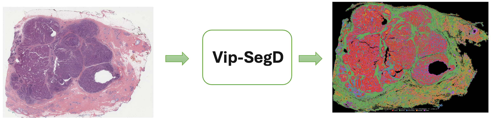

# ViSPACE — Virchow2-Powered Segmentation & Spatial Feature Pipeline

ViSPACE is an end-to-end computational pathology pipeline for whole-slide image (WSI) analysis. It combines the Virchow2 Vision Transformer encoder with a pixel-wise decoder to produce five-class tissue segmentation maps, then extracts rich spatial features from the tumour microenvironment (TME).

<p align="center">
  <br>
  <em>Detailed pipeline architecture — tessellation through spatial feature extraction</em>
</p>

<p align="center">
  <br>
  <em>High-level workflow overview</em>
</p>

---

## Table of Contents

0. [Prerequisites](#prerequisites)
1. [Overview](#overview)
2. [Quick Start](#quick-start)
3. [CLI Reference](#cli-reference)
4. [Running in a Jupyter Notebook](#running-in-a-jupyter-notebook)
5. [Pipeline Stages](#pipeline-stages)
6. [Configuration Reference](#configuration-reference)
7. [Output Directory Layout](#output-directory-layout)
8. [Feature Descriptions](#feature-descriptions)
9. [Running Subsets of Stages](#running-subsets-of-stages)
10. [Dependencies](#dependencies)
11. [Citation](#citation)
12. [License](#license)

---

## Prerequisites

### 1. Create the environment

**Local / server (conda):**

```bash
conda env create -f ViP-SegD_environment.yml
conda activate vipsegd
```

**Google Colab (pip-only):**

```bash
pip install -q -r requirements-colab.txt
```

`requirements-colab.txt` mirrors `ViP-SegD_environment.yml`'s pip packages, minus Quarto (not pip-installable) and the local Jupyter stack (Colab already provides its own — see the comments inside that file before uncommenting those lines).


### 2. Download model weights

Download the ViP-SegD checkpoint and place it at the path you'll set as `CHECKPOINT` (e.g. `TNBC_weights/TNBC_best.pt`).

Virchow2 encoder weights are fetched automatically from the HuggingFace Hub unless `VIRCHOW2_PATH` is set to a local directory — see the next section for the auth this requires.

### 3. HuggingFace account & access token

Virchow2 is a **gated model** — you need a HuggingFace account and access token before the weights can be downloaded (skip this entirely if you set `VIRCHOW2_PATH` to local weights instead).

**Step 1 — create an account:** sign up at [huggingface.co](https://huggingface.co) and verify your email.

**Step 2 — generate an access token:** profile picture (top right) → **Settings** → **Access Tokens** → **New token** → role **Read** → **Generate**. Copy it immediately; it won't be shown again.

> ⚠️ Keep your token private. Never commit it to version control or share it publicly.

**Step 3 — request access to Virchow2:** visit the [Virchow2 model page](https://huggingface.co/paige-ai/Virchow2), click **Request access**. Approval is typically granted within minutes.

**Step 4 — authenticate:**

*Method A — CLI (recommended for servers & scripts):*

```bash
pip install huggingface_hub
huggingface-cli login
# Paste your token when prompted — input is hidden, this is expected
huggingface-cli whoami   # verify
```

To persist across sessions:

```bash
echo 'export HF_TOKEN=hf_your_token_here' >> ~/.bashrc   # or ~/.zshrc
source ~/.bashrc
```

*Method B — Jupyter notebook cell* (see `ViP-SegD_tutorial.ipynb` for the full walkthrough):

```python
import os
from huggingface_hub import whoami

# ✏ Paste your HF access token here (Read role is sufficient)
HF_ACCESS_TOKEN = "hf_your_token_here"

user = whoami(token=HF_ACCESS_TOKEN)
print(f"Authenticated as: {user['name']}")

os.environ["HF_TOKEN"] = HF_ACCESS_TOKEN
print("HF_TOKEN environment variable set.")
```

> ⚠️ **Before committing this notebook**, clear the cell output (Kernel → Restart Kernel and Clear All Outputs) and replace the token string with a placeholder. Consider `python-dotenv` or your platform's secret manager instead of hardcoding it.

> **License note:** Virchow2 is released under the [Paige AI Research License](https://huggingface.co/paige-ai/Virchow2). Review the terms before using ViP-SegD in commercial or clinical settings.

### 5. Optional extras

| Need | Install | Used by |
|---|---|---|
| WSI thumbnail overlay | `pip install openslide-python openslide-bin` | `tumor_roi_overlay.py` (skipped gracefully if absent) |
| HTML report generation | [Quarto CLI](https://quarto.org/docs/get-started/) (not pip-installable — see `requirements-colab.txt` for a Colab install snippet) | `report/generate_report.py` |

Run `python environment_check.py` any time to verify all of the above (dependencies, GPU/precision, paths) before a full run — see [CLI Reference](#cli-reference).

---

## Overview

ViP-SegD processes a WSI in eight sequential stages, orchestrated end-to-end by `run_vipsegd.py`:

| # | Stage | Script | Description |
|---|-------|--------|-------------|
| 1 | Tessellation | `tessellate.py` | Tile the WSI into 224×224 px patches using Mussel |
| 2 | Segmentation | `segmenter.py` | Run Virchow2 + pixel-wise decoder on every patch |
| 3 | Stitching | `stitch.py` | Merge per-patch masks into a slide-level GeoJSON |
| 4 | Tumour ROI Overlay | `tumor_roi_overlay.py` | Identify and cluster high-tumour-content ROI boxes |
| 5 | Cluster TSR / sTILs | `cluster_tils_tsr_score.py` | Compute TSR and sTILs per tumour cluster |
| 6 | Immune Proximity | `immune_proximity_features.py` | TIL–tumour boundary distance features |
| 7 | Necrosis Proximity | `necrosis_proximity_features.py` | Necrosis–tumour & necrosis–immune distance features |
| 8 | Tumour Morphology | `tumor_morphology_features.py` | Shape, fragmentation, and perimeter features per cluster |

**Segmentation classes:** Tumour · Stroma · Necrosis · Inflammatory (TILs) · Others

**Orchestration & utilities** (not pipeline stages themselves):

| Script | Purpose |
|---|---|
| `config.py` | Build and save a run configuration |
| `environment_check.py` | Pre-flight dependency / GPU / path validation |
| `run_vipsegd.py` | Runs all 8 stages, resumable, subset-capable |
| `report/generate_report.py` | Renders an HTML report (Quarto) from a completed run |

---

## Quick Start


```python
from config import PipelineConfig
from run_vipsegd import run_vipsegd

cfg = PipelineConfig(
    OUT_DIR    = "vipsegd_output",
    CHECKPOINT = "TNBC_weights/TNBC_best.pt",
    WSI_PATH   = "slides/your_slide.svs",
    MUSSEL_DIR = "Mussel/",
)

results = run_vipsegd(cfg.WSI_PATH, cfg)

print(results["success"])          # True if all stages completed
print(results["total_elapsed_s"])  # Wall-clock seconds
```

To run every slide in a folder, loop over the files yourself and swap in each path — `WSI_PATH` is per-slide, not a folder setting:

```python
from pathlib import Path
from dataclasses import replace
from config import PipelineConfig
from run_vipsegd import run_vipsegd

base_cfg = PipelineConfig(OUT_DIR="vipsegd_output", CHECKPOINT="TNBC_weights/TNBC_best.pt", MUSSEL_DIR="Mussel/")

for svs in Path("slides/").glob("*.svs"):
    cfg = replace(base_cfg, WSI_PATH=str(svs))
    run_vipsegd(str(svs), cfg)
```

---

## CLI Reference

All scripts share the same conventions: every field on `PipelineConfig` is available as a `--flag`, and every script accepts `--from-json run_config.json` to reuse a config saved once via `config.py --print-config`. Run any script with `--help` to see its full flag list.

### 0. Build the config once

```bash
python config.py \
    --wsi-path slides/TCGA-A1-A0SP.svs \
    --checkpoint TNBC_weights/TNBC_best.pt \
    --mussel-dir Mussel/ \
    --print-config > run_config.json
```

### 1. Pre-flight environment check *(recommended before a long run)*

```bash
python environment_check.py --from-json run_config.json
```

### 2. Authenticate with HuggingFace *(skip if using local Virchow2 weights)*

```bash
huggingface-cli login
```

### 3. Run the full pipeline in one command

```bash
python run_vipsegd.py --from-json run_config.json
```

```bash
# run only a subset of stages (prerequisites must already exist)
python run_vipsegd.py --from-json run_config.json \
    --stages cluster_tils_tsr_score,immune_proximity,necrosis_proximity

# force specific stages to re-run even if output exists
python run_vipsegd.py --from-json run_config.json \
    --force-stages tumor_roi_overlay
```

**— or —** run each stage individually:

```bash
# 3a. tessellate
python tessellate.py --from-json run_config.json

# 3b. segment
python segmenter.py --from-json run_config.json
python segmenter.py --from-json run_config.json --batch-size 96   # override example

# 3c. stitch + GeoJSON
python stitch.py --from-json run_config.json
python stitch.py --from-json run_config.json --min-area-px 200    # override example

# 3d. tumor ROI clustering + overlay
python tumor_roi_overlay.py --from-json run_config.json
python tumor_roi_overlay.py --from-json run_config.json --roi-size-um 150

# 3e. cluster TSR / sTILs scoring
python cluster_tils_tsr_score.py --from-json run_config.json
python cluster_tils_tsr_score.py --from-json run_config.json --tils-denominator tissue

# 3f. immune / TIL proximity features
python immune_proximity_features.py --from-json run_config.json
python immune_proximity_features.py --from-json run_config.json --immune-contact-tolerance-um 10

# 3g. necrosis proximity features
python necrosis_proximity_features.py --from-json run_config.json
python necrosis_proximity_features.py --from-json run_config.json --necrosis-immune-coupling-threshold-um 150

# 3h. tumor morphology features
python tumor_morphology_features.py --from-json run_config.json
python tumor_morphology_features.py --from-json run_config.json --morphology-min-island-area-um2 500
```


### Full command reference table

| # | Script | Purpose | Minimal command |
|---|---|---|---|
| 0 | `config.py` | Build + save the run config | `python config.py --wsi-path ... --checkpoint ... --print-config > run_config.json` |
| — | `environment_check.py` | Validate dependencies, GPU, paths before running | `python environment_check.py --from-json run_config.json` |
| 1 | `tessellate.py` | Tile the WSI (Mussel) | `python tessellate.py --from-json run_config.json` |
| 2 | `segmenter.py` | Run Virchow2 segmentation inference | `python segmenter.py --from-json run_config.json` |
| 3 | `stitch.py` | Stitch tiles → WSI canvas + GeoJSON | `python stitch.py --from-json run_config.json` |
| 4 | `tumor_roi_overlay.py` | Cluster tumor tiles, build ROI boxes | `python tumor_roi_overlay.py --from-json run_config.json` |
| 5 | `cluster_tils_tsr_score.py` | TSR + sTILs scoring per cluster | `python cluster_tils_tsr_score.py --from-json run_config.json` |
| 6 | `immune_proximity_features.py` | TIL proximity to tumor boundary | `python immune_proximity_features.py --from-json run_config.json` |
| 7 | `necrosis_proximity_features.py` | Necrosis proximity + phenotyping | `python necrosis_proximity_features.py --from-json run_config.json` |
| 8 | `tumor_morphology_features.py` | Tumor shape / fragmentation features | `python tumor_morphology_features.py --from-json run_config.json` |
| — | `run_vipsegd.py` | Orchestrates stages 1–8, resumable | `python run_vipsegd.py --from-json run_config.json` |
| — | `report/generate_report.py` | Render the HTML report (Quarto) | `python report/generate_report.py --from-json run_config.json` |

Every stage script also works as a Python import — see the next section.

---

## Running in a Jupyter Notebook

A full walkthrough notebook is provided at `ViP-SegD_tutorial.ipynb`. The short version: every stage exposes a plain Python function (`run_*(wsi_path, cfg)`), so notebook cells can call them directly instead of shelling out with `!`. `cfg` stays in memory across cells — no need to save/reload `run_config.json` within a single session.

```python
# Cell 1 — HF auth
import os
from huggingface_hub import whoami

HF_ACCESS_TOKEN = "hf_your_token_here"
user = whoami(token=HF_ACCESS_TOKEN)
print(f"Authenticated as: {user['name']}")
os.environ["HF_TOKEN"] = HF_ACCESS_TOKEN
```

```python
# Cell 2 — build config + pre-flight check
from config import PipelineConfig
from environment_check import run_environment_check

cfg = PipelineConfig(
    WSI_PATH   = "slides/TCGA-A1-A0SP.svs",
    CHECKPOINT = "TNBC_weights/TNBC_best.pt",
    MUSSEL_DIR = "Mussel/",
)
assert run_environment_check(cfg), "fix environment issues above before continuing"
```

```python
# Cell 3 — run the whole pipeline (skips stages already done)
from run_vipsegd import run_vipsegd

results = run_vipsegd(cfg.WSI_PATH, cfg)
results["success"]
```

```python
# Cell 4 — generate the report
from report.generate_report import generate_report

report_path = generate_report(cfg=cfg, author="Dr. J. Smith", notes="TNBC, pre-treatment biopsy")
report_path
```

```python
# Cell 5 (optional) — view the report inline
from IPython.display import IFrame
IFrame(str(report_path), width=1000, height=800)
```

Prefer running stage-by-stage instead of Cell 3? Swap in the individual `run_*` calls — `run_tessellation`, `run_segmentation`, `run_stitching`, `run_tumor_roi_overlay`, `run_cluster_tils_tsr_score`, `run_immune_proximity_features`, `run_necrosis_proximity_features`, `run_tumor_morphology_features` — each takes `(cfg.WSI_PATH, cfg)` and returns the same result dict `run_vipsegd()` collects internally.

**Report generation requires Quarto on PATH** in the notebook's environment — see the Colab install snippet in `requirements-colab.txt` if you're not running locally.

---

## Pipeline Stages

### Stage 1 — Tessellation (`tessellate.py`)

Tiles the WSI using Mussel with Otsu tissue masking to skip background patches.

```python
from tessellate import run_tessellation
outdir = run_tessellation("slides/slide.svs", cfg)
```

Key parameters: `PATCH_SIZE` (default 224), `WORKERS`, `SEGMENT_THRESH`.

### Stage 2 — Segmentation (`segmenter.py`)

Passes each patch through the Virchow2 ViT-H/14 encoder (1280-d, 256 spatial tokens → 16×16 grid) and a three-stage upsampling decoder with a 1×1 conv classifier, producing a per-pixel class prediction across all five tissue classes. Automatically selects mixed-precision (bf16 on Ampere+, fp16 on Turing/Volta, fp32 elsewhere) based on the GPU's actual tensor-core support.

Key parameters: `DEVICE`, `BATCH_SIZE`, `WHITE_THRESH`, `VIRCHOW2_PATH` (local weights, skips HF download).

### Stage 3 — Stitching (`stitch.py`)

Places each patch mask back at its WSI coordinates and vectorises the result into a slide-level `segmentation_all_classes.geojson`. Also writes a colour-coded segmentation PNG, and automatically deletes the per-tile `.npy` scratch files once both final outputs exist.

Key parameters: `MPP`, `MAX_PX`, `ALPHA`.

### Stage 4 — Tumour ROI Overlay (`tumor_roi_overlay.py`)

Identifies 200 µm ROI boxes with ≥20% tumour content, groups them into spatial clusters (8-connected by default, with optional gap merging), and filters out necrosis-dominated or isolated tiles.

Key parameters: `ROI_SIZE_UM`, `ROI_MIN_TUMOR_FRAC`, `ROI_MAX_NECROSIS`, `ROI_MERGE_GAP_UM`.

### Stage 5 — Cluster TSR / sTILs Scoring (`cluster_tils_tsr_score.py`)

Dissolves each tumour cluster's ROI boxes into a scoring polygon (+ buffer) and computes:

- **TSR** = Stroma / (Tumour + Stroma)
- **sTILs (Salgado)** = Inflammatory / Stroma × 100 — recommended default
- **sTILs (stromal)** = Inflammatory / (Stroma + Inflammatory) × 100
- **sTILs (tissue)** = Inflammatory / Viable tissue × 100

Background pixels are excluded from every denominator. A tissue-fraction reliability gate flags clusters with sparse segmentation coverage.

Key parameters: `TILS_DENOMINATOR`, `CLUSTER_BUFFER_UM`, `CLUSTER_MIN_ROI_BOXES`, `CLUSTER_MIN_TISSUE_FRACTION`.

### Stage 6 — Immune Proximity Features (`immune_proximity_features.py`)

For each tumour cluster, measures the spatial relationship between TIL regions and the tumour boundary:

- % TIL area within 20 / 50 / 100 / 200 µm of the tumour boundary
- Contact fraction, area-weighted median distance, intratumoral TIL fraction
- Phenotype classification: **immune-desert · immune-excluded · margin-localized · peritumoral · immune-penetrated**

Key parameters: `IMMUNE_PROXIMITY_THRESHOLDS_UM`, `IMMUNE_CONTACT_TOLERANCE_UM`, `IMMUNE_PENETRATED_MIN_INTRA_FRAC`.

### Stage 7 — Necrosis Proximity Features (`necrosis_proximity_features.py`)

Characterises necrosis geometry and its spatial coupling with tumour and immune regions:

- % Necrosis area within 50 / 100 µm of the tumour boundary
- Necrosis–immune coupling fraction (within a configurable threshold, default 100 µm)
- Distance to nearest stroma (remodelling proxy)
- Phenotype classification: **necrosis-absent · tumour-central · peritumoural · immune-adjacent · stromal-distant**

Key parameters: `NECROSIS_PROXIMITY_THRESHOLDS_UM`, `NECROSIS_MIN_COMPONENT_AREA_UM2`, `NECROSIS_CENTRAL_MIN_INTRA_FRAC`.

### Stage 8 — Tumour Morphology Features (`tumor_morphology_features.py`)

Extracts shape and fragmentation descriptors for each tumour cluster:

- Total tumour area, perimeter, boundary-per-area ratio
- Compactness, solidity, elongation (area-weighted across islands)
- Island count (size-stratified: fragment / micro / small / large), fragmentation index, patch density
- Islands smaller than `MORPHOLOGY_MIN_ISLAND_AREA_UM2` (default 1,000 µm²) are excluded from shape metrics

Key parameters: `MORPHOLOGY_MIN_ISLAND_AREA_UM2`, `MORPHOLOGY_SAVE_ISLAND_QC`, `MORPHOLOGY_TUMOR_CLASS_NAMES`.

---

## Configuration Reference

All settings live in `config.py`'s `PipelineConfig` dataclass. Override with `dataclasses.replace()`:

```python
from config import cfg
from dataclasses import replace

my_cfg = replace(cfg,
    OUT_DIR    = "/scratch/myproject",
    CHECKPOINT = "weights/phaseA_best.pt",
    MPP        = 0.50,   # 20× slides
    BATCH_SIZE = 16,
)
```

### Required fields

| Field | Default | Description |
|-------|---------|-------------|
| `OUT_DIR` | `"vipsegd_output"` | Root directory for all outputs |
| `CHECKPOINT` | `"TNBC_weights/TNBC_best.pt"` | Path to the ViP-SegD model checkpoint |
| `WSI_PATH` | `"your data path"` | Path to a single .svs / .tif slide (one config = one slide; loop your own script for a folder) |
| `MUSSEL_DIR` | `"Mussel/"` | Path to the cloned Mussel repo root |

### Key optional fields

| Field | Default | Description |
|-------|---------|-------------|
| `MPP` | `0.25` | Microns-per-pixel (0.25 = 40×, 0.50 = 20×) |
| `PATCH_SIZE` | `224` | Tile edge in pixels |
| `BATCH_SIZE` | `64` | GPU inference batch size (frozen encoder — safe to raise if VRAM allows) |
| `DEVICE` | `"cuda"` | `"cuda"` or `"cpu"` |
| `VIRCHOW2_PATH` | `None` | Local Virchow2 weights; `None` downloads from HF Hub |
| `ROI_SIZE_UM` | `200.0` | ROI box edge in microns |
| `ROI_MIN_TUMOR_FRAC` | `0.20` | Minimum tumour fraction to keep a tile |
| `TILS_DENOMINATOR` | `"salgado"` | sTILs denominator variant (`salgado` / `stroma_plus_inflammatory` / `tissue`) |
| `CLUSTER_BUFFER_UM` | `200.0` | Buffer around ROI cluster for the scoring polygon |
| `MORPHOLOGY_MIN_ISLAND_AREA_UM2` | `1000.0` | Minimum tumour island area filter |

Run `python config.py --help` for the complete, always-in-sync flag list (every dataclass field is auto-exposed as a CLI flag).

---

## Output Directory Layout

```
cfg.OUT_DIR/
└── <slide_name>/
    ├── tessellation/
    │   ├── patches/                       # 224×224 patch PNGs
    │   ├── <slide>.h5                     # Mussel tile manifest
    │   ├── mask.png
    │   ├── grid_mask.png
    │   └── thumbnail.png
    │
    ├── segmentation/
    │   ├── manifest.csv                   # Tile-level class fraction table
    │   ├── segmentation_all_classes.geojson
    │   └── <slide>_segmentation.png
    │
    └── spatial_feature_results/
        ├── tumor_roi_overlay/
        │   ├── tumor_roi_boxes.csv
        │   ├── tumor_roi_boxes_pseudo_thumbnail.png
        │   └── tumor_roi_boxes_wsi_thumbnail.png   # only if the WSI file exists on disk
        │
        ├── cluster_tils_tsr_score/
        │   ├── cluster_scoring_polygons.geojson
        │   ├── tils_tsr_by_cluster.csv
        │   ├── tils_tsr_wsi_summary.csv
        │   └── cluster_tils_tsr_overlay.png
        │
        ├── immune_proximity/
        │   ├── immune_proximity_by_cluster.csv
        │   ├── immune_proximity_wsi_summary.csv
        │   └── immune_proximity_plot.png
        │
        ├── necrosis_proximity/
        │   ├── necrosis_proximity_by_cluster.csv
        │   ├── necrosis_proximity_wsi_summary.csv
        │   ├── necrosis_distance_figure.png
        │   └── necrosis_tissue_context_figure.png
        │
        └── tumor_morphology/
            ├── tumor_core_features_by_cluster.csv
            ├── tumor_core_wsi_summary.csv
            └── tumor_island_qc.csv            # only if MORPHOLOGY_SAVE_ISLAND_QC = True
```

The rendered HTML report is saved separately, alongside `report/report.qmd`:

```
report/
└── <slide_name>_report.html
```

---

## Feature Descriptions

Column names below match the actual CSV headers written by each script. Each table shows the most commonly used columns — see the CSV itself for the complete set.

### TSR & sTILs (`tils_tsr_by_cluster.csv`)

| Column | Description |
|--------|-------------|
| `cluster_id` | Spatial tumour cluster identifier |
| `TSR_display` | Human-readable `"tumour%/stroma%"` string |
| `TSR_stroma_fraction` | Raw TSR value: stroma / (tumour + stroma) |
| `TSR_category` | `stroma-high` / `stroma-low` / `unreliable` |
| `sTILs_pct_salgado` | Inflammatory / Stroma × 100 (Salgado 2015) |
| `sTILs_pct_stromal` | Inflammatory / (Stroma + Inflammatory) × 100 |
| `sTILs_pct_tissue` | Inflammatory / viable tissue × 100 |
| `sTILs_level` | `very low` / `low` / `intermediate` / `high` / `unreliable` |
| `tissue_fraction` | Fraction of the cluster polygon with segmentation coverage |

### Immune Proximity (`immune_proximity_by_cluster.csv`)

| Column | Description |
|--------|-------------|
| `til_pct_within_20um` / `_50um` / `_100um` / `_200um` | % TIL area within each distance of the tumour boundary |
| `til_contact_fraction` | Fraction of TIL area within the contact tolerance (default 5 µm) |
| `til_fraction_intratumoral` | Fraction of TIL area located inside the tumour |
| `til_extratumoral_distance_aw_median_um` | Area-weighted median distance for extratumoral TILs |
| `immune_phenotype` | `immune-desert` / `immune-excluded` / `margin-localized` / `peritumoral` / `immune-penetrated` |

### Necrosis Proximity (`necrosis_proximity_by_cluster.csv`)

| Column | Description |
|--------|-------------|
| `necrosis_pct_within_50um` / `_100um` | % necrosis area within each distance of the tumour boundary |
| `necrosis_immune_coupling_index` | Fraction of necrosis area within the immune-coupling threshold |
| `necrosis_fraction_intratumoral` | Fraction of necrosis located inside the tumour |
| `necrosis_phenotype` | `necrosis-absent` / `tumour-central` / `peritumoural` / `immune-adjacent` / `stromal-distant` |

### Tumour Morphology (`tumor_core_features_by_cluster.csv`)

| Column | Description |
|--------|-------------|
| `tumor_area_um2` | Total tumour area in µm² |
| `tumor_solidity_mean` | Area-weighted mean of (island area / island convex-hull area) |
| `tumor_compactness_mean` | Area-weighted mean of 4π·area / perimeter² per island |
| `tumor_elongation_mean` | Area-weighted mean major/minor axis ratio |
| `tumor_n_islands` | Number of disconnected tumour islands (above the min-area filter) |
| `tumor_fragmentation_index` | `1 − largest_patch_index`; higher = more fragmented |

---

## Running Subsets of Stages

Completed stages are automatically skipped (sentinel-file check). To run only specific stages:

```python
# Re-run only scoring stages (segmentation must already exist)
results = run_vipsegd(
    "histology/slide.svs", cfg,
    stages={"cluster_tils_tsr_score", "immune_proximity", "necrosis_proximity"},
)

# Force a specific stage to re-run even if output exists
results = run_vipsegd(
    "histology/slide.svs", cfg,
    force_stages={"tumor_roi_overlay"},
)

# Run a single stage via convenience function
from run_vipsegd import run_stage
result = run_stage("tumor_morphology", "histology/slide.svs", cfg, force=True)
```

Valid stage names: `tessellation` · `segmentation` · `stitching` · `tumor_roi_overlay` · `cluster_tils_tsr_score` · `immune_proximity` · `necrosis_proximity` · `tumor_morphology`

---

## Dependencies

| Package | Version | Purpose |
|---------|---------|---------|
| PyTorch | 2.5.1+cu121 | Model inference |
| timm | 1.0.17 | Virchow2 ViT backbone |
| Mussel | git (pinned commit) | WSI tessellation |
| tiffslide | 2.5.1 | SVS/TIF reading |
| geopandas / shapely | 1.1.1 / 2.1.1 | GeoJSON spatial operations |
| opencv-python-headless | 4.12.0.88 | Image processing |
| h5py | 3.14.0 | Tile storage |
| pandas | 2.3.1 | Feature tables |
| scikit-image | 0.25.2 | Morphology helpers |

See `ViP-SegD_environment.yml` for the complete pinned conda environment, or `requirements-colab.txt` for the pip-only equivalent used on Google Colab.

---

## Citation

If you use ViP-SegD in your research, please cite the associated publication (forthcoming).

---

## License

See `LICENSE` for terms of use.